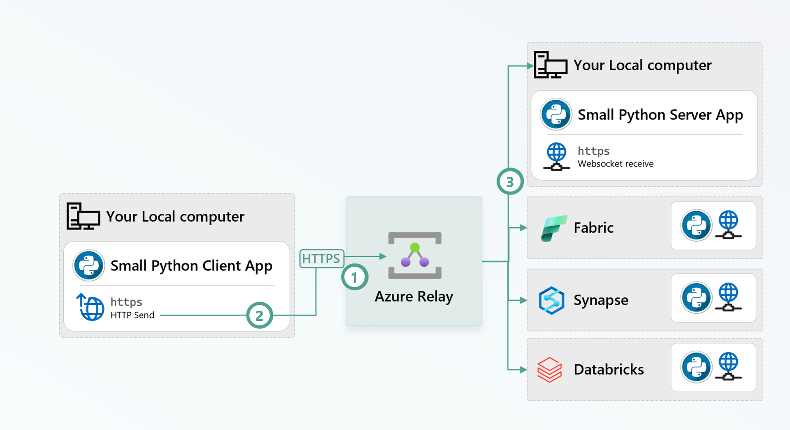

# privy

Remote Python/bash execution over Azure Relay. Server runs in a Fabric notebook; clients POST code and get back stdout/stderr/exit_code.



> [See more here - How to setup a secured tunnel from your local machine to Fabric, Databricks, Synapse or anywhere else](https://www.rakirahman.me/relay-tunnel/).

## Setup

```bash
SUB="ce859648-30e1-4135-9d0f-8358aebfe789"
RG="fabricbenchmark"
NS="fabricbenchmark"
HC="dbt"
RULE="dbt-listen-send"

az account set --subscription "$SUB"
az group create -n "$RG" -l eastus 2>/dev/null || true
az relay namespace create -g "$RG" -n "$NS" -l eastus 2>/dev/null || true
az relay hyco create -g "$RG" --namespace-name "$NS" -n "$HC" --requires-client-authorization true 2>/dev/null || true
az relay hyco authorization-rule create -g "$RG" --namespace-name "$NS" --hybrid-connection-name "$HC" -n "$RULE" --rights Listen Send 2>/dev/null || true
KEY=$(az relay hyco authorization-rule keys list -g "$RG" --namespace-name "$NS" --hybrid-connection-name "$HC" -n "$RULE" --query primaryKey -o tsv)

cat > .env <<EOF
PRIVY_RELAY_NAMESPACE=$NS
PRIVY_RELAY_PATH=$HC
PRIVY_RELAY_KEYRULE=$RULE
PRIVY_RELAY_KEY=$KEY
EOF
```

## Loop

```bash
source ~/.bashrc
set -a; source .env; set +a

uv sync                    # re-run after any pyproject.toml change
uv run ruff check .        # static checks
uv run ruff format .       # autoformat
uv run pytest              # unit tests
uv build                   # → dist/privy-<version>-py3-none-any.whl (version comes from src/privy/__init__.py)
./scripts/build_binary.sh  # → dist/privy (self-contained Linux binary, no Python needed on target)
./scripts/upload_whl.sh    # az storage blob upload --overwrite (wheel + binary)
```

## Run server locally (two terminals)

Terminal 1 — server:

```bash
set -a; source .env; set +a
uv run python -c "
import os
from privy import RelayServer
RelayServer(
    namespace=os.environ['PRIVY_RELAY_NAMESPACE'],
    path=os.environ['PRIVY_RELAY_PATH'],
    keyrule=os.environ['PRIVY_RELAY_KEYRULE'],
    key=os.environ['PRIVY_RELAY_KEY'],
).serve_forever()
"
```

Terminal 2 — client:

```bash
set -a; source .env; set +a
uv run python -c "
import os
from privy import RelayClient
c = RelayClient(
    namespace=os.environ['PRIVY_RELAY_NAMESPACE'],
    path=os.environ['PRIVY_RELAY_PATH'],
    keyrule=os.environ['PRIVY_RELAY_KEYRULE'],
    key=os.environ['PRIVY_RELAY_KEY'],
)
print(c.run_bash('echo hello from privy').stdout)
print(c.run_python('import sys; print(sys.version)').stdout)
"
```

## Random box with no Python

Self-contained Linux binary (~11 MB, bundled interpreter). No Python, pip or venv on the target.

```bash
export PRIVY_RELAY_NAMESPACE=... PRIVY_RELAY_PATH=... PRIVY_RELAY_KEYRULE=... PRIVY_RELAY_KEY=...

curl -fsSL https://rakirahman.blob.core.windows.net/public/bins/privy-linux-x86_64 -o privy && chmod +x privy
./privy server -v                                                 # SERVER (-v = pretty req/resp boxes)
./privy client --bash "uname -a"                                  # CLIENT
./privy client --python "import sys; print(sys.version)" --mode inprocess
./privy proxy --local-port 3000                                   # PROXY
```

Flags override the four `PRIVY_RELAY_*` env vars: `--namespace --path --keyrule --key`, plus `-v/-vv`.
Versioned URL: `bins/privy-<version>-linux-x86_64`. Build locally with `./scripts/build_binary.sh`.

| Subcommand | Args                                                                                                                                                                                          |
| ---------- | --------------------------------------------------------------------------------------------------------------------------------------------------------------------------------------------- |
| `server`   | `--max-workers 32` · `--recv-timeout-s 1.0` · `--proxy-target URL`                                                                                                                            |
| `client`   | `--bash CODE` \| `--python CODE` \| `--file PATH` (`-` = stdin) · `--file-kind python\|bash` · `--mode subprocess\|inprocess` · `--timeout-s 600` · `--async-job`/`--no-async-job` · `--json` |
| `proxy`    | `--local-port 3000`                                                                                                                                                                           |

Client exits with the remote exit code (`124` on timeout). `--timeout-s` above 55s auto-uses the job path.

Caveats: linux x86_64, glibc-linked (build on the oldest distro you target). With no `python3` on `PATH`,
`--python --mode subprocess` fails by design — use `--mode inprocess` or `--bash`.

## Fabric notebook (server)

```python
%pip install --force-reinstall https://rakirahman.blob.core.windows.net/public/whls/privy-0.1.0-py3-none-any.whl
```

```python
from privy import RelayServer
RelayServer(namespace="...", path="...", keyrule="...", key="...", inprocess_globals={"spark": spark, "sc": sc}).serve_forever()
```

## Client

```python
import os
from privy import RelayClient

c = RelayClient(
    namespace=os.environ["PRIVY_RELAY_NAMESPACE"],
    path=os.environ["PRIVY_RELAY_PATH"],
    keyrule=os.environ["PRIVY_RELAY_KEYRULE"],
    key=os.environ["PRIVY_RELAY_KEY"],
)

r = c.run_bash("pip install pandas")
r = c.run_python("import pandas; print(pandas.__version__)")
print(r.exit_code, r.stdout, r.stderr)
```

Or:

```bash
set -a; source .env; set +a
uv run python -c "
import os
from privy import RelayClient
c = RelayClient(
    namespace=os.environ['PRIVY_RELAY_NAMESPACE'],
    path=os.environ['PRIVY_RELAY_PATH'],
    keyrule=os.environ['PRIVY_RELAY_KEYRULE'],
    key=os.environ['PRIVY_RELAY_KEY'],
)
print(c.run_python('spark.sql(\"SHOW DATABASES\").show(truncate=False)', mode='inprocess').stdout)
"
```

## Long-running work

Azure Relay kills any request whose listener has not responded in roughly a
minute:

```
504 ... the listener did not respond in the required time
```

That is a _transport_ limit, not a limit on your code — a five-minute Spark
query would fail even though the query itself is fine.

`privy` therefore runs long work as a **job**: the request returns a `job_id`
immediately, the work continues in the background, and the client collects the
result with follow-up polls. Each poll blocks _server-side_ until the job
finishes or ~20s elapse (long-polling), so completion is noticed within
milliseconds while still using very few relay round-trips.

This is automatic — anything with `timeout_s` above `RELAY_RESPONSE_LIMIT_S`
(55s) takes the job path, and the returned `ExecResult` is identical either way:

```python
# Runs for 10 minutes; returns normally instead of a 504.
r = c.run_python("df = spark.sql(big_query); print(df.count())",
                 mode="inprocess", timeout_s=1200)
print(r.exit_code, r.stdout, r.job_id)
```

Override the choice with `async_job=True` / `async_job=False`:

```python
c.run_python("print('hi')", timeout_s=600, async_job=False)  # force one round-trip
c.run_bash("pip install torch", timeout_s=30, async_job=True)  # force a job
```

The job API is also usable directly, e.g. to submit work now and collect it
later, or from a different process:

```python
from privy import ExecRequest

req = ExecRequest(kind="python", code="spark.sql(q).write.save(path)",
                  mode="inprocess", timeout_s=3600)
job_id = c.submit(req)
...
state, result = c.poll(req, job_id, wait_s=20)   # state: running | done | cancelled | missing
c.cancel(req, job_id)                             # best-effort interrupt
```

Notes:

- Jobs are held in memory on the listener and reaped one hour after they finish
  (`PRIVY_JOB_RETENTION_S`). A notebook restart loses them.
- `mode="inprocess"` executions run **concurrently** — stdout/stderr are captured
  per-thread, so parallel callers (e.g. dbt threads) no longer serialize behind
  one another. Set `PRIVY_SERIALIZE_INPROCESS=1` for the old one-at-a-time
  behaviour.
- A long-polling request occupies one server worker for its wait, so keep
  `RelayServer(max_workers=...)` (default 32) above your expected concurrency.

# Browse a Fabric served API/UI locally

In the Fabric notebook cell where you start Privy, use `proxy_target`:

```python
from privy import RelayServer
RelayServer(
    namespace="...", path="...", keyrule="...", key="...",
    proxy_target="http://127.0.0.1:8080",
).serve_forever()
```

On your laptop — start the local proxy:

```bash
set -a; source .env; set +a
uv run python -c "
import os
from privy import ProxyClientServer

proxy = ProxyClientServer(
    namespace=os.environ['PRIVY_RELAY_NAMESPACE'],
    path=os.environ['PRIVY_RELAY_PATH'],
    keyrule=os.environ['PRIVY_RELAY_KEYRULE'],
    key=os.environ['PRIVY_RELAY_KEY'],
    local_port=3000,
)
proxy.serve_forever()
"
```

Open http://localhost:3000 in your browser and browse the UI!

## Stress test (32 concurrent calls)

Terminal 1 — server:

```bash
set -a; source .env; set +a
uv run python -c "
import os
from privy import RelayServer
RelayServer(
    namespace=os.environ['PRIVY_RELAY_NAMESPACE'],
    path=os.environ['PRIVY_RELAY_PATH'],
    keyrule=os.environ['PRIVY_RELAY_KEYRULE'],
    key=os.environ['PRIVY_RELAY_KEY'],
).serve_forever()
"
```

Terminal 2 — client:

```bash
set -a; source .env; set +a
uv run python -c "
import os, time
from concurrent.futures import ThreadPoolExecutor
from privy import RelayClient
c = RelayClient(**{k[12:].lower(): v for k, v in os.environ.items() if k.startswith('PRIVY_RELAY_')})
NUM_CALLS = 10
def worker(t):
    for i in range(NUM_CALLS):
        t0 = time.time(); c.run_bash('echo hi'); print(f'thread {t:02d} call {i:02d}: {time.time()-t0:.3f}s')
with ThreadPoolExecutor(32) as ex: list(ex.map(worker, range(32)))
"
```
